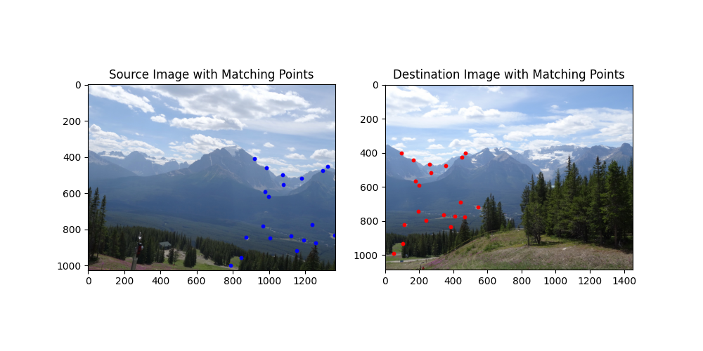
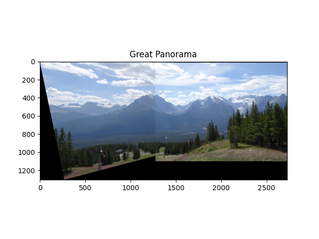
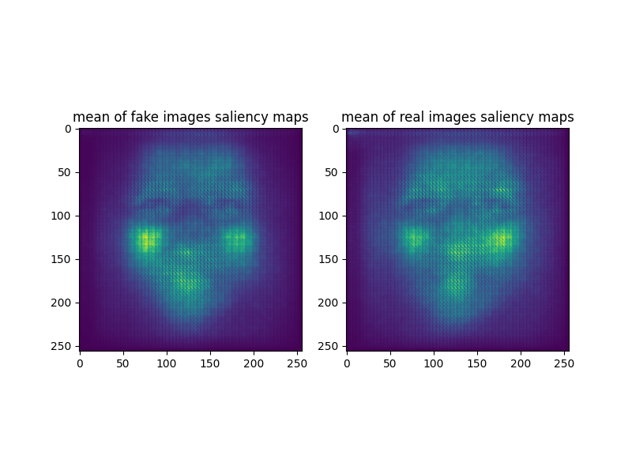

# Computer_Vision_Course

## Overview
This repository contains the coursework, assignments, and projects from the Computer Vision course. The projects are implemented using Python and focus on practical applications of computer vision technologies and deep learning models.

---

### Assignments
- **Assignment 1: Homography & Panorama**
  - Implementation of homography and image stitching to create panoramas.

    Given: 
    

    Display the panorama image using image stitching techniques: 
    

- **Assignment 2: Introduction to CNNs**
  - An introductory project to Convolutional Neural Networks, including building and training a model for image classification.

---

## Project

## [Real/Fake Classifier](https://github.com/nimiCurtis/Computer_Vision_Course/tree/main/Project%20-%20Real_Fake%20Classifier)
This project aims to classify images as real or fake using deep learning models. The classifier is trained on a dataset of labeled images and evaluates its accuracy in distinguishing genuine images from manipulated ones.

### Technical Details
- **Dataset**: Utilizes two distinct datasets; one for deepfake detection and another for synthetic image detection.
- **Models**: Implements several architectures including SimpleNet and a fine-tuned Xception model.
- **Analysis**: Employs techniques like Saliency Maps and Grad-CAM to interpret model decisions.

Example for mean saliency maps based on Xception net: 

### Key Results
- Achieved high accuracy in detecting synthetic images, demonstrating effective learning and generalization across diverse image manipulations.
- Detailed analysis of model behavior using visual explanation tools highlighted critical areas affecting classification decisions.

For a comprehensive understanding of the project's scope and methodologies, refer to the full [project report](Project_Real_Fake_Classifier/Nimrod_Project_Report.pdf).

